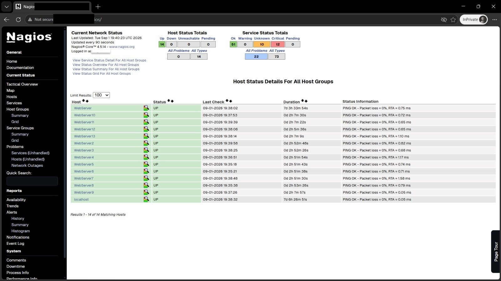
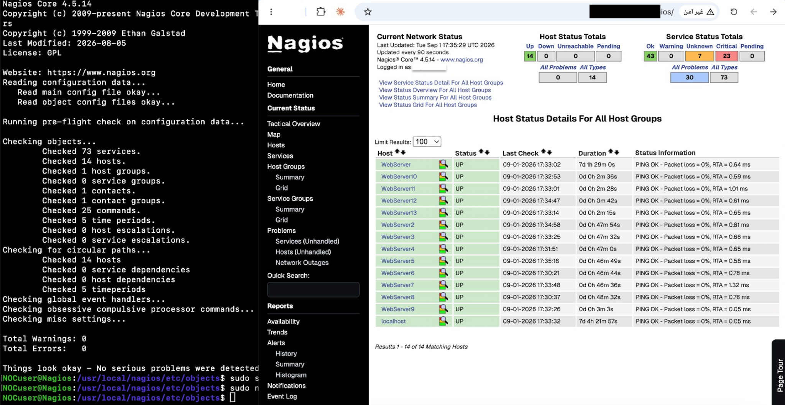
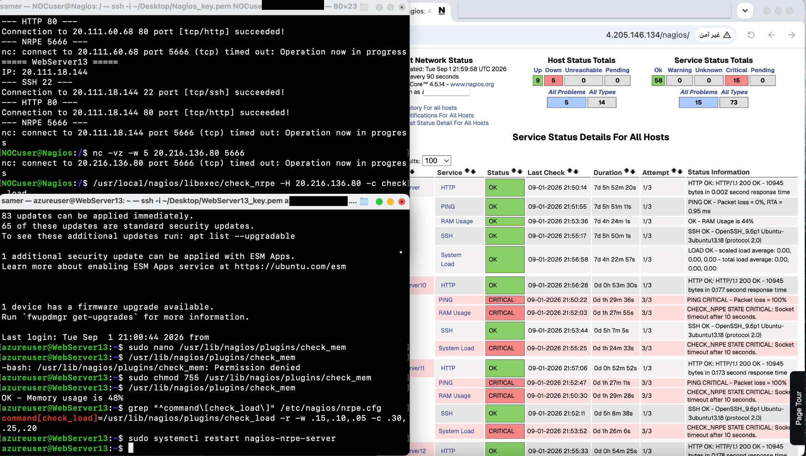

# Nagios Core – Linux Infrastructure Monitoring


A hands-on infrastructure monitoring project built around **Nagios Core** and **NRPE**, focused on centralized monitoring, Linux service checks, configuration management, and practical troubleshooting.

> **Portfolio note:** This repository is a sanitized version of the lab environment. Config files use placeholder addresses (no real IPs), and credentials, private keys, and personally-identifying details (e.g. the operator's source login IP) have been redacted from the screenshots. The lab's Azure VM public IPs are still visible in the screenshots themselves — that environment has since been decommissioned, so those addresses are no longer live or reachable.

## Project Overview

The objective was to build and configure a centralized Nagios Core monitoring server for a group of Linux web servers and verify both external service availability and internal system health.

The monitored target group covered **WebServer2–WebServer13 (12 Linux servers)**. Each server was configured with five monitoring services:

| Check | Method | Purpose |
|---|---|---|
| PING | Direct | Network reachability and latency |
| SSH | Direct | SSH service availability |
| HTTP | Direct | Web service availability |
| System Load | NRPE | Internal system load |
| RAM Usage | NRPE | Internal memory utilization |


The project demonstrates two monitoring layers:

- **Direct checks:** PING, SSH and HTTP are checked from the central Nagios server.
- **Agent-based checks:** NRPE executes `check_load` and `check_mem` on the monitored Linux host.

## Implementation

### 1. Host and service configuration

Individual Nagios host definitions were created for the target servers and registered through the main Nagios configuration.

The service model follows the configuration guide supplied for the lab: PING, SSH and HTTP are direct checks, while System Load and RAM Usage use NRPE. The reference guide is included under `docs/`.

### 2. NRPE integration

NRPE was configured on the monitored Linux servers for internal metrics.

Example Nagios service definition:

```text
check_command check_nrpe!check_load
check_command check_nrpe!check_mem
```

A custom `check_mem` command was also added where it was missing. After correcting the command definition and restarting NRPE, memory checks returned successful readings on the affected nodes.

### 3. Automation

The client-side NRPE setup (install NRPE + plugins, define `check_load`/`check_mem`, open port 5666, restart the service) was repetitive across 12 hosts, so it was scripted in [`scripts/setup-nrpe-client.sh`](scripts/setup-nrpe-client.sh). The script encodes the same fix used to resolve the `check_mem` "command not defined" issue described below, so re-running it on a fresh host avoids that failure mode entirely.

### 4. Configuration validation

Before applying configuration changes, Nagios configuration validation was performed. The final validation screenshot shows:

```text
Total Warnings: 0
Total Errors:   0
Things look okay - No serious problems were detected
```

## Troubleshooting

This project was not limited to a successful installation; a significant part of the work involved isolating monitoring failures.

### NRPE command definition issue

An initial failure appeared as:

```text
NRPE: Command 'check_mem' not defined
```

The issue was traced to the monitored server's NRPE configuration. The missing command was defined, the NRPE service was restarted, and the check was verified again.

### NRPE connectivity / firewall issue

For the public-addressed servers, testing showed:

- SSH/22: reachable
- HTTP/80: reachable
- NRPE/5666: timeout

Additional checks included NRPE service status, listening socket verification, UFW/iptables inspection, `nc` connectivity tests, and packet capture with `tcpdump`.

This helped distinguish a **service configuration problem** from an **external network/firewall path problem**.

See [`docs/troubleshooting.md`](docs/troubleshooting.md) for the diagnostic sequence.

## Results

At the final documented stage:

- Nagios Core configuration was validated successfully.
- The target Linux hosts were visible in the Nagios dashboard.
- PING, SSH and HTTP monitoring were configured.
- System Load and RAM Usage were working on reachable nodes.
- The missing `check_mem` definition was corrected on affected servers.
- NRPE/5666 connectivity remained blocked for the public-addressed group, indicating an external network/firewall constraint rather than a local NRPE process failure.

## Screenshots

### 1. Nagios dashboard — all monitored hosts UP



### 2. Nagios configuration validation



### 3. NRPE troubleshooting and connectivity diagnostics




## Tools & Technologies

- Nagios Core 4.5.14
- NRPE (Nagios Remote Plugin Executor)
- Ubuntu Linux
- Nagios Monitoring Plugins
- Bash / Shell
- SSH
- HTTP
- TCP/IP
- UFW / iptables
- netcat (`nc`)
- tcpdump

## What this project demonstrates

- Centralized Linux infrastructure monitoring
- Nagios host/service configuration
- NRPE-based remote monitoring
- Linux service and socket troubleshooting
- Network connectivity isolation
- Configuration validation and controlled troubleshooting
- Practical monitoring operations and documentation

## Scope

This repository focuses on the **Nagios Core + Linux monitoring workflow**. Cloud-provider administration was part of the original lab environment but is intentionally not presented as a core dependency of this portfolio project.
